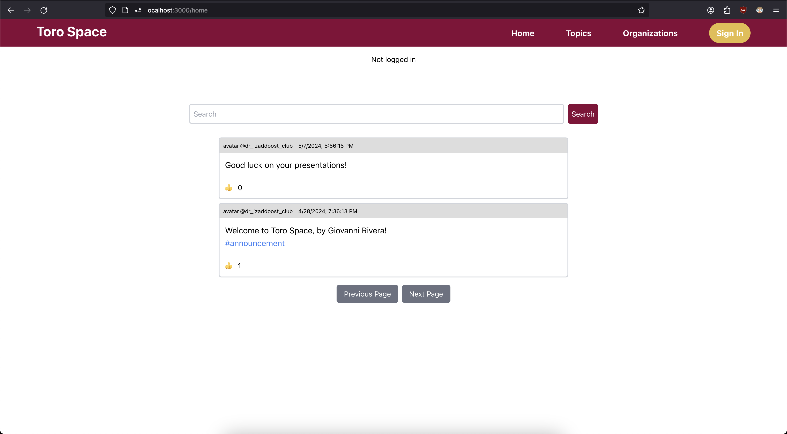

# Toro-Space 🚀🌎

Toro Space is a platform made to extend the reach of 
clubs and organizations at California State University,
Dominguez Hills to students looking for a way to
interact with and learn more about their campus communities.



## Tech Stack ⚙️

### Frontend (UI/UX)

- React.JS [[Repository](https://github.com/facebook/react)]

### Backend (Server/API)

- GoFiber [[Repository](https://github.com/gofiber/fiber)]

### Microservices (Server/RPC)

- gRPC [[Repository](https://github.com/grpc/grpc)
- Protocol Buffers (protobuf) [Repository](https://github.com/protocolbuffers/protobuf)]

### Database (SQL)

- SQLite [[Repository](https://sqlite.org/src/dir?ci=trunk)]
    - Controlled in backend via GORM
    [[Repository](https://github.com/go-gorm/gorm)]

## Running Locally 💻

### Pre-requisites:
- Frontend
    - Node.js v22.1.0 or higher & Node Package Manager (npm) v10.7.0 or higher [[Download](https://nodejs.org/en/download)]
- Backend
    - Go v1.17 or higher [[Download](https://go.dev/dl/)]
- Microservices
    - Python v3.8.19
        - (Recommended) Conda for version control
        [[Download](https://conda.io/projects/conda/en/latest/user-guide/install/index.html)]
    - Protocol Buffers (protbuf) compiler `protoc`
    [[Download](https://github.com/protocolbuffers/protobuf/releases/latest)]
- Database (SQL)
    - SQLite (sqlite3) [[Download](https://www.sqlite.org/download.html)]

### Steps

1. Clone the repository to your local machine.

Open your terminal and type in:

```sh
# Clone using git
git clone https://github.com/grivera64/Toro-Space.git

# Enter the cloned project
cd Toro-Space
```

> **Important ❗️**: The root of the cloned repository 
> (Toro-Space) will be denoted by `//`.
>
> Example: `//README.md` is `Toro-Space/README.md`

2. Train (might take a long time based on your GPU power)

In the same terminal, run:

```sh
# Inside of //microservices 
cd microservices

# If using Conda for python, uncomment the below
# conda create -n toro-space python=3.8
# conda activate toro-space

python install_requirements.py
python spam_detector_emails.py
```

> Note: If the training is too long, you can
> use the provided `spam_detector_model` folder already provided
> and move on to step 3.

3. Run microservices

In the same terminal, run:

```sh
# Still inside of //microservices 
# cd Toro-Space/microservices

# If you have not already done it
# in the above step, run this command:
# python install_requirements.py

python spam_detector.py
```

4. Build backend

In a different terminal, run:

```sh
# Inside of //backend
cd Toro-Space/backend

# Create and fill out an .env file
# with Google Auth Fields from the tutorial:
# https://developers.google.com/identity/protocols/oauth2
mkdir ./bin
cp .env.example ./bin/.env

# Build backend server
cd cmd
go build . -o ./bin/toro_space
```

5. Run backend

In the same terminal, run:

```sh
# Still inside of //backend
# cd Toro-Space/backend

cd ./bin
./toro_space
```

6. Build frontend

In a different terminal, run:

```sh
# Inside of //frontend
cd Toro-Space/frontend

# Install npm dependencies
npm install
```

7. Run frontend

```sh
# Still inside of //frontend
# cd Toro-Space/frontend

# Run frontend server
npm start
```

> Note: If you want to stop running the server,
> you must `ctrl + c` the terminals with a running
> program.

## Author 💻

- Giovanni Rivera ([@grivera64](https://github.com/grivera64))

